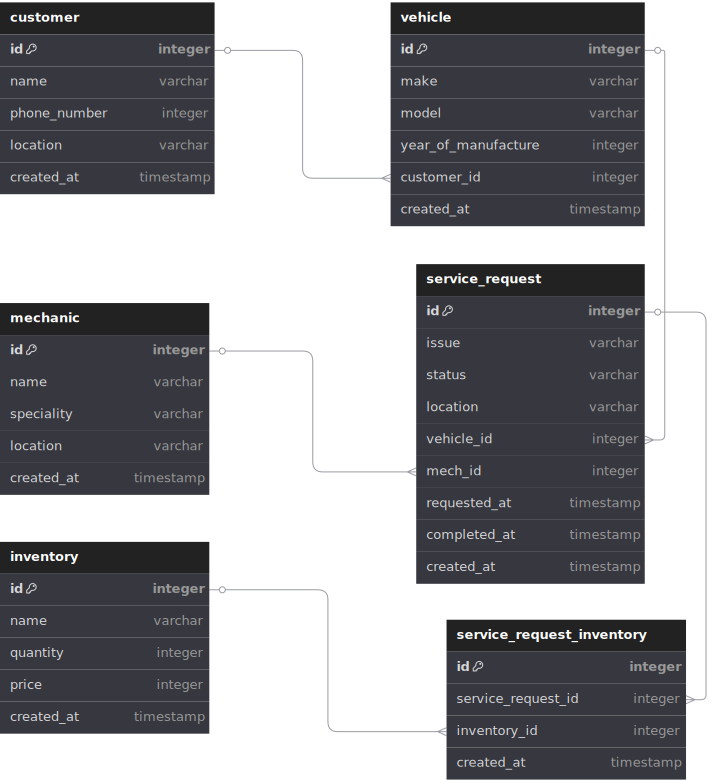

# Mobile Garage CLI App 

A command-line application that simulates a mobile garage service, where customers can request repairs and mechanics can be assigned to fix vehicles. The app also manages inventory for spare parts, and links them to service requests.

---
**Author:** Faith Nkarichia

## loom link
* [link](https://www.loom.com/share/4d0c174368e24f93ba27a26845fdb6e4?sid=7b9b07ed-a48e-4596-911a-4ffe739164ce)

## github link
* https://github.com/faithnkarichia/mobile_garage_management_system#

## System Architecture


## Features

- **🧰 Inventory Management**  
  Easily add, edit, view, and delete spare parts. Keep track of part names, prices, and availability to support efficient service delivery.

- **🧑‍🔧 Mechanics & 👥 Customers**  
  Create, update, view, and delete mechanic and customer records. Store key information such as names, contact details, and link them to their related services.

- **🚘 Vehicles**  
  Add vehicles with details like make, model, and year of manufacture. Each vehicle is associated with a specific customer, making it easy to trace service history.

- **🛠️ Service Requests**  
  Create and manage repair requests by assigning them to vehicles and mechanics. Track issues, status, location, and timestamps for when the service was requested or completed.

- **🔗 Link Spare Parts to Service Requests**  
  Associate spare parts with specific service requests using the `ServiceRequestInventory` model. This enables itemized billing and better inventory usage tracking.

- **📝 Edit Any Record from the CLI**  
  Use the centralized edit menu to update details for service requests, inventory items, vehicles, customers, mechanics, or linked spare parts — all from the command line.


## Technologies Used

- Python 3
- SQLAlchemy (ORM)
- SQLite (as the database)
- tabulate (for formatted CLI tables)

---

## 🛠️ Setup Instructions

1. **Clone the Repository:**

   ```bash
   git clone https://github.com/your-username/mobile_garage.git
   cd mobile_garage  
   ```
2.  **Create and Activate a Virtual Environment (Optional but recommended):**
    ```
    python3 -m venv venv
    source venv/bin/activate 
    ```

3. **Install the requirements**
    ``` 
    pip install -r requirements.txt
    ```
4. **Run the app**
    ```
    python main.py
    ```


   
   
